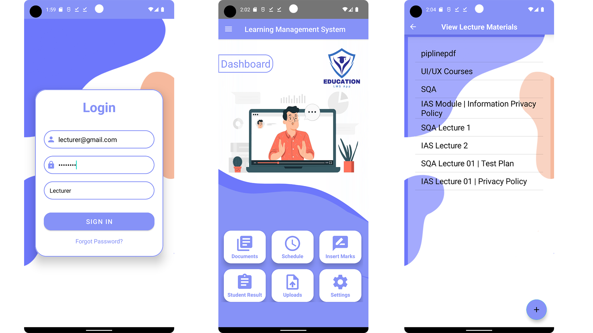
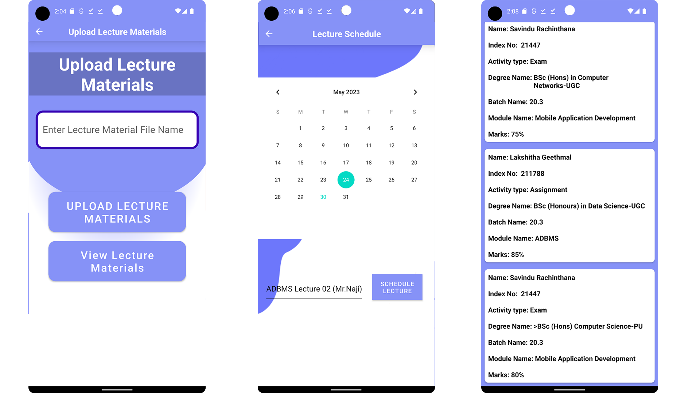

# University Learning Management System
#  

This Mobile-based Learning Management System (LMS) project aims to fulfill the requirements of creating pages, adding graphics, making buttons, and integrating an information architecture. These elements are essential for developing a user-friendly and visually appealing application that enhances the educational experience for both students and lecturers.

## Access Control Levels

- Lecturer
- Student

## Features

- **Download Lecture Materials**: Lecturers can upload lecture materials, and students can easily download them for reference.
- **View Marks/Grade Student Assignments**: Students can view their marks or grades for the assignments they have submitted.
- **Lecture Schedules**: Lecturers can schedule lectures, allowing students to stay organized and prepared.
- **Assignment Upload**: Students can upload their assignments directly through the application.

## Technologies Used

This project utilizes the following technologies:

- 
- 
- 
  - Backend-as-a-Service (BaaS) platform for cloud storage and real-time database
- 
  - Version control system for tracking changes in source code

## Screenshots

Here are some screenshots showcasing the user interface of the University Learning Management System:

